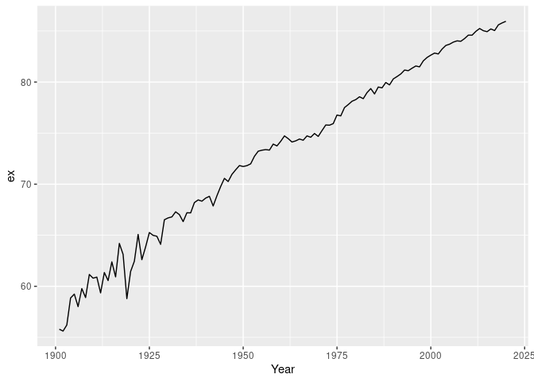
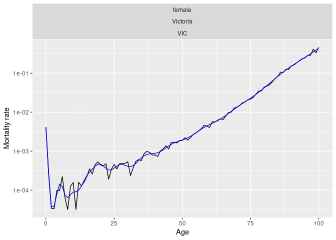
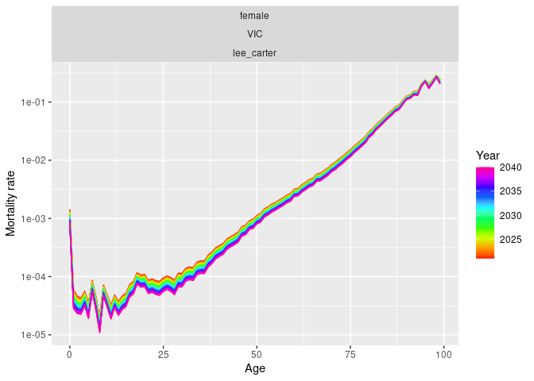

<!-- README.md is generated from README.Rmd. Please edit that file -->

# vital

<!-- badges: start -->

[](https://github.com/robjhyndman/vital/actions/workflows/R-CMD-check.yaml)
<!-- badges: end -->

The goal of vital is to allow analysis of demographic data using tidy
tools.

## Installation

You can install the development version of vital from
[GitHub](https://github.com/) with:

``` r
# install.packages("devtools")
devtools::install_github("robjhyndman/vital")
```

## Example

``` r
library(vital)
library(dplyr)
#> 
#> Attaching package: 'dplyr'
#> The following objects are masked from 'package:stats':
#> 
#>     filter, lag
#> The following objects are masked from 'package:base':
#> 
#>     intersect, setdiff, setequal, union
library(ggplot2)

# Examples using Victorian females
vic_female <- aus_mortality |>
  filter(State == "Victoria", Sex == "female")

# Lifetable in 2020
vic_female |> 
  filter(Year == 2020) |>
  life_table()
#> # A vital: 101 x 12 [?]
#> # Key:     Age, Sex, State, Code [101]
#>     Year Sex   State Code       mx      qx    lx      dx    Lx    Tx    ex   Age
#>    <int> <chr> <chr> <chr>   <dbl>   <dbl> <dbl>   <dbl> <dbl> <dbl> <dbl> <int>
#>  1  2020 fema… Vict… VIC   2.52e-3 2.52e-3 1     2.52e-3 0.998  85.9  85.9     0
#>  2  2020 fema… Vict… VIC   2.14e-4 2.14e-4 0.997 2.14e-4 0.997  84.9  85.2     1
#>  3  2020 fema… Vict… VIC   5.27e-5 5.27e-5 0.997 5.26e-5 0.997  84.0  84.2     2
#>  4  2020 fema… Vict… VIC   1.04e-4 1.04e-4 0.997 1.04e-4 0.997  83.0  83.2     3
#>  5  2020 fema… Vict… VIC   5.06e-5 5.06e-5 0.997 5.04e-5 0.997  82.0  82.2     4
#>  6  2020 fema… Vict… VIC   0       0       0.997 0       0.997  81.0  81.2     5
#>  7  2020 fema… Vict… VIC   1.01e-4 1.01e-4 0.997 1.00e-4 0.997  80.0  80.2     6
#>  8  2020 fema… Vict… VIC   7.50e-5 7.50e-5 0.997 7.48e-5 0.997  79.0  79.2     7
#>  9  2020 fema… Vict… VIC   1.25e-4 1.25e-4 0.997 1.25e-4 0.997  78.0  78.2     8
#> 10  2020 fema… Vict… VIC   0       0       0.997 0       0.997  77.0  77.2     9
#> # ℹ 91 more rows

# Life expectancy
vic_female |> 
  life_expectancy() |> 
  ggplot(aes(x = Year, y = ex)) +
  geom_line()
```



``` r

# Smoothed data
vic_female |> 
  filter(Year == 2010) |> 
  smooth_mortality(Mortality) |>
  autoplot(Mortality) +
  geom_line(aes(y = .smooth), col = "blue") +
  ylab("Mortality rate") +
  scale_y_log10()
```



``` r

# Lee-Carter model
lc <- vic_female |>
  model(lee_carter = LC(log(Mortality)))
report(lc)
#> Series: Mortality 
#> Model: LC 
#> Transformation: log(Mortality) 
#> 
#> Options:
#>   Adjust method: dt
#>   Jump choice: fit
#> 
#> Age functions
#> # A tibble: 101 × 3
#>     Age    ax     bx
#>   <int> <dbl>  <dbl>
#> 1     0 -4.15 0.0157
#> 2     1 -6.40 0.0218
#> 3     2 -7.01 0.0195
#> 4     3 -7.32 0.0180
#> 5     4 -7.36 0.0159
#> # ℹ 96 more rows
#> 
#> Time coefficients
#> # A tsibble: 120 x 2 [1Y]
#>    Year    kt
#>   <int> <dbl>
#> 1  1901 111. 
#> 2  1902 111. 
#> 3  1903 109. 
#> 4  1904 100. 
#> 5  1905  98.8
#> # ℹ 115 more rows
#> 
#> Time series model: RW w/ drift 
#> 
#> Variance explained: 72.99%

autoplot(lc)
```


``` r

# Forecasts from Lee-Carter model
lc |>
  forecast(h = 20) |>
  autoplot(Mortality) +
  ylab("Mortality rate") +
  scale_y_log10()
```


