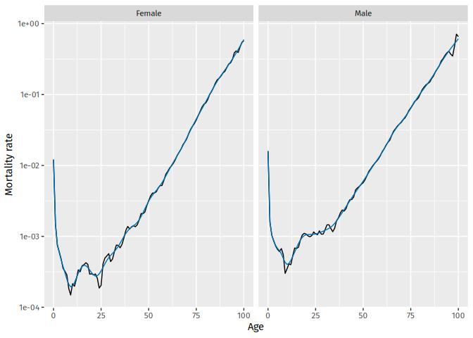

<!-- README.md is generated from README.Rmd. Please edit that file -->

# vital 

<!-- badges: start -->

[](https://github.com/robjhyndman/vital/actions/workflows/R-CMD-check.yaml)
<!-- badges: end -->

The goal of vital is to allow analysis of demographic data using tidy
tools.

## Installation

You can install the **stable** version from
[CRAN](https://cran.r-project.org/package=vital):

``` r
pak::pak("vital")
```

You can install the **development** version from
[Github](https://github.com/robjhyndman/vital):

``` r
pak::pak("robjhyndman/vital")
```

## Examples

First load the necessary packages.

``` r
library(vital)
library(tsibble)
library(dplyr)
library(ggplot2)
```

### vital objects

The basic data object is a `vital`, which is time-indexed tibble that
contains vital statistics such as births, deaths, population counts, and
mortality and fertility rates.

Here is an example of a `vital` object containing mortality data for
Norway.

``` r
norway_mortality <- norway_mortality |>
  collapse_ages(max_age = 100)
```

We can use functions to see which variables are index, key or vital:

``` r
index_var(norway_mortality)
#> [1] "Year"
key_vars(norway_mortality)
#> [1] "Age" "Sex"
vital_vars(norway_mortality)
#>          age          sex       deaths   population 
#>        "Age"        "Sex"     "Deaths" "Population"
```

### Plots

``` r
norway_mortality |>
  filter(Sex != "Total", Year < 1980, Age < 90) |>
  autoplot(Mortality) + scale_y_log10()
```


### Life tables and life expectancy

``` r
# Life table for Norwegian males in 2000
norway_mortality |>
  filter(Sex == "Male", Year == 2000) |>
  life_table()
#> # A vital: 101 x 13 [?]
#> # Key:     Age x Sex [101 x 1]
#>     Year   Age Sex        mx      qx    lx      dx    Lx    Tx    ex    rx    nx
#>    <int> <int> <chr>   <dbl>   <dbl> <dbl>   <dbl> <dbl> <dbl> <dbl> <dbl> <dbl>
#>  1  2000     0 Male  4.26e-3 4.24e-3 1     4.24e-3 0.996  76.0  76.0 0.996     1
#>  2  2000     1 Male  5.93e-4 5.93e-4 0.996 5.90e-4 0.995  75.0  75.3 0.999     1
#>  3  2000     2 Male  2.29e-4 2.29e-4 0.995 2.28e-4 0.995  74.0  74.3 1.000     1
#>  4  2000     3 Male  1.57e-4 1.57e-4 0.995 1.56e-4 0.995  73.0  73.3 1.000     1
#>  5  2000     4 Male  2.21e-4 2.21e-4 0.995 2.20e-4 0.995  72.0  72.3 1.000     1
#>  6  2000     5 Male  1.89e-4 1.89e-4 0.995 1.88e-4 0.994  71.0  71.4 1.000     1
#>  7  2000     6 Male  1.28e-4 1.28e-4 0.994 1.27e-4 0.994  70.0  70.4 1.000     1
#>  8  2000     7 Male  1.27e-4 1.27e-4 0.994 1.26e-4 0.994  69.0  69.4 1.000     1
#>  9  2000     8 Male  9.40e-5 9.40e-5 0.994 9.34e-5 0.994  68.0  68.4 1.000     1
#> 10  2000     9 Male  2.17e-4 2.17e-4 0.994 2.16e-4 0.994  67.0  67.4 1.000     1
#> # ℹ 91 more rows
#> # ℹ 1 more variable: ax <dbl>
```

``` r
# Life expectancy
norway_mortality |>
  filter(Sex != "Total") |>
  life_expectancy() |>
  ggplot(aes(x = Year, y = ex, color = Sex)) +
  geom_line()
```


### Smoothing

Several smoothing functions are provided: `smooth_spline()`,
`smooth_mortality()`, `smooth_fertility()`, and `smooth_loess()`, each
smoothing across the age variable for each year.

``` r
# Smoothed data
norway_mortality |>
  filter(Sex != "Total", Year == 1967) |>
  smooth_mortality(Mortality) |>
  autoplot(Mortality) +
  geom_line(aes(y = .smooth), col = "#0072B2") +
  ylab("Mortality rate") +
  scale_y_log10()
```



### Mortality models

Several mortality models are available including variations on
Lee-Carter models (Lee & Carter, JASA, 1992), and functional data models
(Hyndman & Ullah, CSDA, 2007).

``` r
fit <- norway_mortality |>
  filter(Sex != "Total") |>
  model(
    lee_carter = LC(log(Mortality)),
    fdm = FDM(log(Mortality))
  )
fit
#> # A mable: 2 x 3
#> # Key:     Sex [2]
#>   Sex    lee_carter     fdm
#>   <chr>     <model> <model>
#> 1 Female       <LC>   <FDM>
#> 2 Male         <LC>   <FDM>
```

Models are fitted for all combinations of key variables excluding age.

``` r
fit |>
  select(lee_carter) |>
  filter(Sex == "Female") |>
  report()
#> Series: Mortality 
#> Model: LC 
#> Transformation: log(Mortality) 
#> 
#> Options:
#>   Adjust method: dt
#>   Jump choice: fit
#> 
#> Age functions
#> # A tibble: 101 × 3
#>     Age    ax     bx
#>   <int> <dbl>  <dbl>
#> 1     0 -4.33 0.0155
#> 2     1 -6.16 0.0223
#> 3     2 -6.77 0.0193
#> 4     3 -7.14 0.0187
#> 5     4 -7.18 0.0165
#> # ℹ 96 more rows
#> 
#> Time coefficients
#> # A tsibble: 124 x 2 [1Y]
#>    Year    kt
#>   <int> <dbl>
#> 1  1900  115.
#> 2  1901  109.
#> 3  1902  103.
#> 4  1903  109.
#> 5  1904  106.
#> # ℹ 119 more rows
#> 
#> Time series model: RW w/ drift 
#> 
#> Variance explained: 66.33%
```

``` r
fit |>
  select(lee_carter) |>
  autoplot()
```


``` r
fit |>
  select(lee_carter) |>
  age_components()
#> # A tibble: 202 × 4
#>    Sex      Age    ax     bx
#>    <chr>  <int> <dbl>  <dbl>
#>  1 Female     0 -4.33 0.0155
#>  2 Female     1 -6.16 0.0223
#>  3 Female     2 -6.77 0.0193
#>  4 Female     3 -7.14 0.0187
#>  5 Female     4 -7.18 0.0165
#>  6 Female     5 -7.41 0.0174
#>  7 Female     6 -7.45 0.0165
#>  8 Female     7 -7.48 0.0155
#>  9 Female     8 -7.37 0.0125
#> 10 Female     9 -7.39 0.0124
#> # ℹ 192 more rows
fit |>
  select(lee_carter) |>
  time_components()
#> # A tsibble: 248 x 3 [1Y]
#> # Key:       Sex [2]
#>    Sex     Year    kt
#>    <chr>  <int> <dbl>
#>  1 Female  1900 115. 
#>  2 Female  1901 109. 
#>  3 Female  1902 103. 
#>  4 Female  1903 109. 
#>  5 Female  1904 106. 
#>  6 Female  1905 110. 
#>  7 Female  1906 101. 
#>  8 Female  1907 106. 
#>  9 Female  1908 105. 
#> 10 Female  1909  99.6
#> # ℹ 238 more rows
```

``` r
fit |> forecast(h = 20)
#> # A vital fable: 8,080 x 6 [1Y]
#> # Key:           Age x (Sex, .model) [101 x 4]
#>    Sex    .model      Year   Age          Mortality    .mean
#>    <chr>  <chr>      <dbl> <int>             <dist>    <dbl>
#>  1 Female lee_carter  2024     0 t(N(-6.8, 0.0088)) 0.00110 
#>  2 Female lee_carter  2025     0  t(N(-6.9, 0.018)) 0.00106 
#>  3 Female lee_carter  2026     0  t(N(-6.9, 0.027)) 0.00103 
#>  4 Female lee_carter  2027     0  t(N(-6.9, 0.036)) 0.00100 
#>  5 Female lee_carter  2028     0    t(N(-7, 0.045)) 0.000972
#>  6 Female lee_carter  2029     0    t(N(-7, 0.055)) 0.000944
#>  7 Female lee_carter  2030     0    t(N(-7, 0.064)) 0.000916
#>  8 Female lee_carter  2031     0  t(N(-7.1, 0.074)) 0.000889
#>  9 Female lee_carter  2032     0  t(N(-7.1, 0.084)) 0.000863
#> 10 Female lee_carter  2033     0  t(N(-7.1, 0.094)) 0.000838
#> # ℹ 8,070 more rows
```

The forecasts are returned as a distribution column (here transformed
normal because of the log transformation used in the model). The `.mean`
column gives the point forecasts equal to the mean of the distribution
column.
