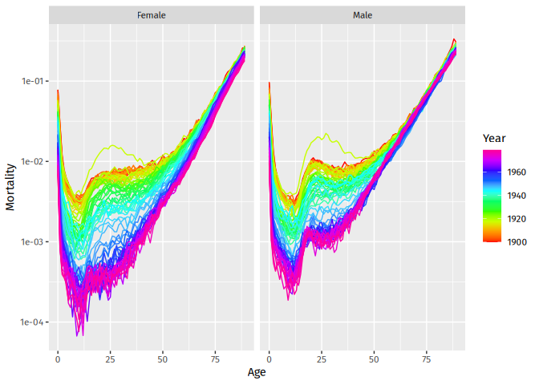

<!-- README.md is generated from README.Rmd. Please edit that file -->

# vital 

<!-- badges: start -->

[](https://github.com/robjhyndman/vital/actions/workflows/R-CMD-check.yaml)
<!-- badges: end -->

The goal of vital is to allow analysis of demographic data using tidy
tools.

## Installation

You can install the **stable** version from
[CRAN](https://cran.r-project.org/package=vital):

``` r
pak::pak("vital")
```

You can install the **development** version from
[Github](https://github.com/robjhyndman/vital):

``` r
pak::pak("robjhyndman/vital")
```

## Example

First load the necessary packages.

``` r
library(vital)
library(dplyr)
#> 
#> Attaching package: 'dplyr'
#> The following objects are masked from 'package:stats':
#> 
#>     filter, lag
#> The following objects are masked from 'package:base':
#> 
#>     intersect, setdiff, setequal, union
```

``` r
library(ggplot2)
```

### vital objects

The basic data object is a `vital`.

``` r
# Examples using Victorian females
vic_female <- aus_mortality |>
  filter(State == "Victoria", Sex == "female")
vic_female
#> # A vital: 12,000 x 8 [1Y]
#> # Key:     Age, Sex, Code [100]
#>     Year   Age Sex    State    Code  Mortality Exposure Deaths
#>    <int> <int> <chr>  <chr>    <chr>     <dbl>    <dbl>  <dbl>
#>  1  1901     0 female Victoria VIC     0.100      13993   1405
#>  2  1901     1 female Victoria VIC     0.0235     13079    308
#>  3  1901     2 female Victoria VIC     0.00806    12409    100
#>  4  1901     3 female Victoria VIC     0.00472    12931     61
#>  5  1901     4 female Victoria VIC     0.00370    12986     48
#>  6  1901     5 female Victoria VIC     0.00324    13589     44
#>  7  1901     6 female Victoria VIC     0.00310    13872     43
#>  8  1901     7 female Victoria VIC     0.00284    14077     40
#>  9  1901     8 female Victoria VIC     0.00261    14198     37
#> 10  1901     9 female Victoria VIC     0.00225    14694     33
#> # ℹ 11,990 more rows
```

This example contains just Victorian females from 1901 to 2020. It must
have a time index variable (here `Year`), an age variable (here `Age`)
and optionally other categorical variables that uniquely define each
time series (here `Sex`, `State` and `Code`). These categorical
varaibles, along with the age variable, are “key” variables. Other
columns contain variables of interest: `Mortality`, `Exposure`,
`Deaths`.

There are `autoplot()` functions for plotting `vital` objects.

``` r
vic_female |> 
  autoplot(Exposure)
```



### Life tables and life expectancy

Lifetables can be produced using the `life_table()` function. It will
produce lifetables for each unique combination of the index and key
variables other than age.

``` r
# Lifetable in 2000
vic_female |>
  filter(Year == 2000) |>
  life_table()
#> # A vital: 100 x 14 [?]
#> # Key:     Age, Sex, Code [100]
#>     Year   Age Sex   Code       mx      qx    lx      dx    Lx    Tx    ex    rx
#>    <int> <int> <chr> <chr>   <dbl>   <dbl> <dbl>   <dbl> <dbl> <dbl> <dbl> <dbl>
#>  1  2000     0 fema… VIC   4.02e-3 4.01e-3 1     4.01e-3 0.996  82.7  82.7 0.996
#>  2  2000     1 fema… VIC   2.70e-4 2.70e-4 0.996 2.69e-4 0.996  81.7  82.0 1.00 
#>  3  2000     2 fema… VIC   3.38e-5 3.38e-5 0.996 3.37e-5 0.996  80.7  81.0 1.00 
#>  4  2000     3 fema… VIC   3.32e-5 3.32e-5 0.996 3.30e-5 0.996  79.7  80.0 1.00 
#>  5  2000     4 fema… VIC   9.83e-5 9.83e-5 0.996 9.79e-5 0.996  78.7  79.0 1.00 
#>  6  2000     5 fema… VIC   9.65e-5 9.65e-5 0.996 9.61e-5 0.996  77.7  78.0 1.00 
#>  7  2000     6 fema… VIC   2.22e-4 2.22e-4 0.995 2.21e-4 0.995  76.7  77.0 1.00 
#>  8  2000     7 fema… VIC   6.32e-5 6.32e-5 0.995 6.29e-5 0.995  75.7  76.0 1.00 
#>  9  2000     8 fema… VIC   3.16e-5 3.16e-5 0.995 3.14e-5 0.995  74.7  75.1 1.00 
#> 10  2000     9 fema… VIC   1.25e-4 1.25e-4 0.995 1.25e-4 0.995  73.7  74.1 1.00 
#> # ℹ 90 more rows
#> # ℹ 2 more variables: nx <dbl>, ax <dbl>
```

Life expectancy ($e_x$ with $x=0$ by default) is computed using
`life_expectancy()`:

``` r
# Life expectancy
vic_female |>
  life_expectancy() |>
  ggplot(aes(x = Year, y = ex)) +
  geom_line()
```


### Smoothing

Several smoothing functions are provided: `smooth_spline()`,
`smooth_mortality()`, `smooth_fertility()`, and `smooth_loess()`, each
smoothing across the age variable for each year.

``` r
# Smoothed data
vic_female |>
  filter(Year == 2000) |>
  smooth_mortality(Mortality) |>
  autoplot(Mortality) +
  geom_line(aes(y = .smooth), col = "blue") +
  ylab("Mortality rate") +
  scale_y_log10()
```


### Lee-Carter models

Lee-Carter models (Lee & Carter, JASA, 1992) are estimated using the
`LC` function which must be called within a `model` function:

``` r
# Lee-Carter model
lc <- vic_female |>
  model(lee_carter = LC(log(Mortality)))
report(lc)
#> Series: Mortality 
#> Model: LC 
#> Transformation: log(Mortality) 
#> 
#> Options:
#>   Adjust method: dt
#>   Jump choice: fit
#> 
#> Age functions
#> # A tibble: 100 × 3
#>     Age    ax     bx
#>   <int> <dbl>  <dbl>
#> 1     0 -4.15 0.0158
#> 2     1 -6.40 0.0219
#> 3     2 -7.01 0.0196
#> 4     3 -7.32 0.0181
#> 5     4 -7.36 0.0160
#> # ℹ 95 more rows
#> 
#> Time coefficients
#> # A tsibble: 120 x 2 [1Y]
#>    Year    kt
#>   <int> <dbl>
#> 1  1901 110. 
#> 2  1902 111. 
#> 3  1903 109. 
#> 4  1904 100. 
#> 5  1905  98.4
#> # ℹ 115 more rows
#> 
#> Time series model: RW w/ drift 
#> 
#> Variance explained: 73%
```

``` r
autoplot(lc)
```


``` r
# Forecasts from Lee-Carter model
lc |>
  forecast(h = 20) |>
  autoplot() +
  ylab("Mortality rate") +
  scale_y_log10()
```


### Coherent functional data models

Functional data models (Hyndman & Ullah, CSDA, 2007) can be estimated in
the same way as Lee-Carter models, with `LC` replaced by `FDM`. A
coherent functional data model (Hyndman, Booth & Yasmeen, Demography,
2013), can be used as follows.

``` r
# Coherent forecasts from FDM model
nor <- norway_mortality |>
  dplyr::filter(Sex != "Total") |>
  collapse_ages() 
fit <- nor |> 
  smooth_mortality(Mortality) |> 
  make_pr(.smooth) |>
  model(hby = FDM(log(.smooth), coherent = TRUE))
fc <- fit |>
  forecast(h = 20) |>
  undo_pr(.smooth)
nor |> 
  filter(Year > 1950) |> 
  ggplot(aes(x = Age, y = Mortality, group = Year)) +
  facet_grid(. ~ Sex) +
  geom_line(color = "grey") +
  scale_y_log10() +
  geom_line(data = fc, aes(y = .mean, color = Year)) +
  scale_color_gradientn(colors = rainbow(25))
#> Warning in scale_y_log10(): log-10 transformation introduced infinite values.
```


Here, `make_pr()` makes the product-ratios, while `undo_pr()` undoes
them.
