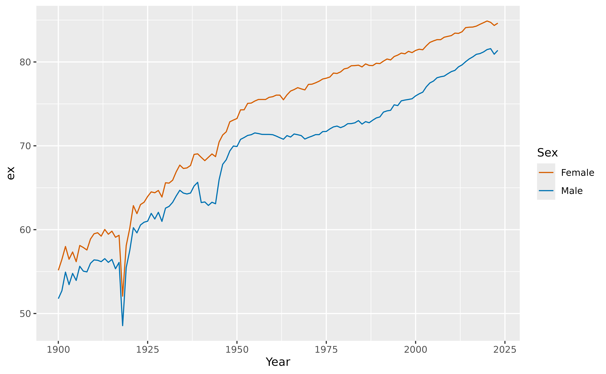

# Introduction to the vital package

The goal of vital is to allow analysis of demographic data using tidy
tools. It works with other [tidyverse
packages](https://www.tidyverse.org) such as
[dplyr](https://dplyr.tidyverse.org) and
[ggplot2](https://ggplot2.tidyverse.org). It also works with the
[tidyverts](https://tidyverts.org) packages,
[tsibble](https://tsibble.tidyverts.org) and
[fable](https://fable.tidyverts.org).

``` r
library(vital)
library(tsibble)
library(dplyr)
library(ggplot2)
```

## vital objects

The basic data object is a `vital`, which is a time-indexed tibble that
contains vital statistics such as births, deaths, population counts, and
mortality and fertility rates.

We will use Norwegian data in the following examples. First, let’s
remove the “Total” Sex category and collapse the upper ages into a final
age group of 100+.

``` r
nor <- norway_mortality |>
  filter(Sex != "Total") |>
  collapse_ages(max_age = 100)
nor
#> # A vital: 25,048 x 7 [1Y]
#> # Key:     Age x Sex [101 x 2]
#>     Year   Age OpenInterval Sex    Population Deaths Mortality
#>    <int> <int> <lgl>        <chr>       <dbl>  <dbl>     <dbl>
#>  1  1900     0 FALSE        Female      30070 2376.    0.0778 
#>  2  1900     1 FALSE        Female      28960  842     0.0290 
#>  3  1900     2 FALSE        Female      28043  348     0.0123 
#>  4  1900     3 FALSE        Female      27019  216.    0.00786
#>  5  1900     4 FALSE        Female      26854  168.    0.00624
#>  6  1900     5 FALSE        Female      25569  140.    0.00538
#>  7  1900     6 FALSE        Female      25534  108.    0.00422
#>  8  1900     7 FALSE        Female      24314   93.5   0.00376
#>  9  1900     8 FALSE        Female      24979   93.5   0.00380
#> 10  1900     9 FALSE        Female      24428   90     0.00365
#> # ℹ 25,038 more rows
```

This example contains data from 1900 to 2023. There are 101 age groups
and 2 Sex categories. A vital must have a time “index” variable, and
optionally other categorical variables known as “key” variables. Each
row must have a unique combination of the index and key variables. Some
columns are “vital” variables, such as “Age” and “Sex”.

We can use functions to see which variables are index, key or vital:

``` r
index_var(nor)
#> [1] "Year"
key_vars(nor)
#> [1] "Age" "Sex"
vital_vars(nor)
#>          age          sex       deaths   population 
#>        "Age"        "Sex"     "Deaths" "Population"
```

## Plots

There are
[`autoplot()`](https://ggplot2.tidyverse.org/reference/autoplot.html)
functions for plotting `vital` objects. These produce rainbow plots
(Hyndman and Shang 2010) where each line represents data for one year,
and the variable is plotted against age.

``` r
nor |>
  autoplot(Mortality) +
  scale_y_log10()
```


We can use standard ggplot functions to modify the plot as desired. For
example, here are population pyramids for all years.

``` r
nor |>
  mutate(Population = if_else(Sex == "Female", -Population, Population)) |>
  autoplot(Population) +
  coord_flip() +
  facet_grid(. ~ Sex, scales = "free_x")
```


## Life tables and life expectancy

Life tables (Chiang 1984) can be produced using the
[`life_table()`](https://pkg.robjhyndman.com/vital/reference/life_table.md)
function. It will produce life tables for each unique combination of the
index and key variables other than age.

``` r
# Life tables for males and females in Norway in 2000
nor |>
  filter(Year == 2000) |>
  life_table()
#> # A vital: 202 x 13 [?]
#> # Key:     Age x Sex [101 x 2]
#>     Year   Age Sex        mx      qx    lx      dx    Lx    Tx    ex    rx    nx
#>    <int> <int> <chr>   <dbl>   <dbl> <dbl>   <dbl> <dbl> <dbl> <dbl> <dbl> <dbl>
#>  1  2000     0 Fema… 3.28e-3 3.27e-3 1     3.27e-3 0.997  81.4  81.4 0.997     1
#>  2  2000     1 Fema… 2.77e-4 2.77e-4 0.997 2.76e-4 0.997  80.4  80.6 1.000     1
#>  3  2000     2 Fema… 3.09e-4 3.09e-4 0.996 3.08e-4 0.996  79.4  79.7 1.000     1
#>  4  2000     3 Fema… 1.33e-4 1.33e-4 0.996 1.32e-4 0.996  78.4  78.7 1.000     1
#>  5  2000     4 Fema… 1.68e-4 1.68e-4 0.996 1.67e-4 0.996  77.4  77.7 1.000     1
#>  6  2000     5 Fema… 3.30e-5 3.30e-5 0.996 3.29e-5 0.996  76.4  76.7 1.000     1
#>  7  2000     6 Fema… 1.35e-4 1.35e-4 0.996 1.34e-4 0.996  75.4  75.7 1.000     1
#>  8  2000     7 Fema… 1.68e-4 1.68e-4 0.996 1.67e-4 0.996  74.4  74.7 1.000     1
#>  9  2000     8 Fema… 6.70e-5 6.70e-5 0.996 6.67e-5 0.995  73.4  73.7 1.000     1
#> 10  2000     9 Fema… 1.97e-4 1.97e-4 0.995 1.96e-4 0.995  72.4  72.7 1.000     1
#> # ℹ 192 more rows
#> # ℹ 1 more variable: ax <dbl>
```

Life expectancy ($e_{x}$ with $x = 0$ by default) is computed using
[`life_expectancy()`](https://pkg.robjhyndman.com/vital/reference/life_expectancy.md):

``` r
# Life expectancy for males and females in Norway
nor |>
  life_expectancy() |>
  ggplot(aes(x = Year, y = ex, color = Sex)) +
  geom_line()
```



## Smoothing

Several smoothing functions are provided:
[`smooth_spline()`](https://pkg.robjhyndman.com/vital/reference/smooth_vital.md),
[`smooth_mortality()`](https://pkg.robjhyndman.com/vital/reference/smooth_vital.md),
[`smooth_fertility()`](https://pkg.robjhyndman.com/vital/reference/smooth_vital.md),
and
[`smooth_loess()`](https://pkg.robjhyndman.com/vital/reference/smooth_vital.md),
each smoothing across the age variable for each year. The methods used
in
[`smooth_mortality()`](https://pkg.robjhyndman.com/vital/reference/smooth_vital.md)
and
[`smooth_fertility()`](https://pkg.robjhyndman.com/vital/reference/smooth_vital.md)
are described in Hyndman and Ullah (2007).

``` r
# Smoothed data
nor |>
  filter(Year == 1967) |>
  smooth_mortality(Mortality) |>
  autoplot(Mortality) +
  geom_line(aes(y = .smooth), col = "#0072B2") +
  ylab("Mortality rate") +
  scale_y_log10()
```


## Lee-Carter models

Lee-Carter models (Lee and Carter 1992) are estimated using the
[`LC()`](https://pkg.robjhyndman.com/vital/reference/LC.md) function
which must be called within a
[`model()`](https://fabletools.tidyverts.org/reference/model.html)
function:

``` r
# Lee-Carter model
lc <- nor |>
  model(lee_carter = LC(log(Mortality)))
lc
#> # A mable: 2 x 2
#> # Key:     Sex [2]
#>   Sex    lee_carter
#>   <chr>     <model>
#> 1 Female       <LC>
#> 2 Male         <LC>
```

Models are fitted for all combinations of key variables excluding age.
To see the details for a specific model, use the
[`report()`](https://fabletools.tidyverts.org/reference/report.html)
function.

``` r
lc |>
  filter(Sex == "Female") |>
  report()
#> Series: Mortality 
#> Model: LC 
#> Transformation: log(Mortality) 
#> 
#> Options:
#>   Adjust method: dt
#>   Jump choice: fit
#> 
#> Age functions
#> # A tibble: 101 × 3
#>     Age    ax     bx
#>   <int> <dbl>  <dbl>
#> 1     0 -4.33 0.0155
#> 2     1 -6.16 0.0223
#> 3     2 -6.77 0.0193
#> 4     3 -7.14 0.0187
#> 5     4 -7.18 0.0165
#> # ℹ 96 more rows
#> 
#> Time coefficients
#> # A tsibble: 124 x 2 [1Y]
#>    Year    kt
#>   <int> <dbl>
#> 1  1900  115.
#> 2  1901  109.
#> 3  1902  103.
#> 4  1903  109.
#> 5  1904  106.
#> # ℹ 119 more rows
#> 
#> Time series model: RW w/ drift 
#> 
#> Variance explained: 66.33%
```

The results can be plotted.

``` r
autoplot(lc)
```


The components can be extracted.

``` r
age_components(lc)
#> # A tibble: 202 × 4
#>    Sex      Age    ax     bx
#>    <chr>  <int> <dbl>  <dbl>
#>  1 Female     0 -4.33 0.0155
#>  2 Female     1 -6.16 0.0223
#>  3 Female     2 -6.77 0.0193
#>  4 Female     3 -7.14 0.0187
#>  5 Female     4 -7.18 0.0165
#>  6 Female     5 -7.41 0.0174
#>  7 Female     6 -7.45 0.0165
#>  8 Female     7 -7.48 0.0155
#>  9 Female     8 -7.37 0.0125
#> 10 Female     9 -7.39 0.0124
#> # ℹ 192 more rows
time_components(lc)
#> # A tsibble: 248 x 3 [1Y]
#> # Key:       Sex [2]
#>    Sex     Year    kt
#>    <chr>  <int> <dbl>
#>  1 Female  1900 115. 
#>  2 Female  1901 109. 
#>  3 Female  1902 103. 
#>  4 Female  1903 109. 
#>  5 Female  1904 106. 
#>  6 Female  1905 110. 
#>  7 Female  1906 101. 
#>  8 Female  1907 106. 
#>  9 Female  1908 105. 
#> 10 Female  1909  99.6
#> # ℹ 238 more rows
```

Forecasts are obtained using the
[`forecast()`](https://generics.r-lib.org/reference/forecast.html)
function

``` r
# Forecasts from Lee-Carter model
lc |>
  forecast(h = 20)
#> # A vital fable: 4,040 x 6 [1Y]
#> # Key:           Age x (Sex, .model) [101 x 2]
#>    Sex    .model      Year   Age          Mortality    .mean
#>    <chr>  <chr>      <dbl> <int>             <dist>    <dbl>
#>  1 Female lee_carter  2024     0 t(N(-6.8, 0.0088)) 0.00110 
#>  2 Female lee_carter  2025     0  t(N(-6.9, 0.018)) 0.00106 
#>  3 Female lee_carter  2026     0  t(N(-6.9, 0.027)) 0.00103 
#>  4 Female lee_carter  2027     0  t(N(-6.9, 0.036)) 0.00100 
#>  5 Female lee_carter  2028     0    t(N(-7, 0.045)) 0.000972
#>  6 Female lee_carter  2029     0    t(N(-7, 0.055)) 0.000944
#>  7 Female lee_carter  2030     0    t(N(-7, 0.064)) 0.000916
#>  8 Female lee_carter  2031     0  t(N(-7.1, 0.074)) 0.000889
#>  9 Female lee_carter  2032     0  t(N(-7.1, 0.084)) 0.000863
#> 10 Female lee_carter  2033     0  t(N(-7.1, 0.094)) 0.000838
#> # ℹ 4,030 more rows
```

The forecasts are returned as a distribution column (here transformed
normal because of the log transformation used in the model). The `.mean`
column gives the point forecasts equal to the mean of the distribution
column.

## Functional data models

Functional data models (Hyndman and Ullah 2007) can be estimated in a
similar way to Lee-Carter models, but with an additional smoothing step,
then modelling with `LC` replaced by `FDM`.

``` r
# FDM model
fdm <- nor |>
  smooth_mortality(Mortality) |>
  model(hu = FDM(log(.smooth)))
fc_fdm <- fdm |>
  forecast(h = 20)
autoplot(fc_fdm) +
  scale_y_log10()
```


Functional data models have multiple principal components, rather than
the single factor used in Lee-Carter models.

``` r
fdm |>
  autoplot(show_order = 3)
```


By default, six factors are estimated using
[`FDM()`](https://pkg.robjhyndman.com/vital/reference/FDM.md). Here we
have chosen to plot only the first three.

The components can be extracted.

``` r
age_components(fdm)
#> # A tibble: 202 × 9
#>    Sex      Age  mean  phi1     phi2     phi3    phi4     phi5    phi6
#>    <chr>  <dbl> <dbl> <dbl>    <dbl>    <dbl>   <dbl>    <dbl>   <dbl>
#>  1 Female     0 -4.34 0.133  0.257    0.0933  -0.0790 -0.0626   0.0496
#>  2 Female     1 -6.13 0.185  0.232   -0.00843 -0.243  -0.145    0.392 
#>  3 Female     2 -6.82 0.167  0.192   -0.0932  -0.239   0.00395  0.0676
#>  4 Female     3 -7.15 0.159  0.187   -0.158   -0.252   0.0838  -0.0257
#>  5 Female     4 -7.36 0.156  0.171   -0.209   -0.256   0.110   -0.119 
#>  6 Female     5 -7.50 0.153  0.145   -0.232   -0.240   0.120   -0.229 
#>  7 Female     6 -7.60 0.150  0.113   -0.241   -0.167   0.0931  -0.246 
#>  8 Female     7 -7.69 0.148  0.0761  -0.251   -0.0526  0.0317  -0.158 
#>  9 Female     8 -7.75 0.146  0.0372  -0.262    0.0586 -0.0442  -0.0344
#> 10 Female     9 -7.78 0.144 -0.00131 -0.266    0.142  -0.120    0.0639
#> # ℹ 192 more rows
time_components(fdm)
#> # A tsibble: 248 x 9 [1Y]
#> # Key:       Sex [2]
#>    Sex     Year  mean beta1   beta2  beta3    beta4   beta5  beta6
#>    <chr>  <int> <dbl> <dbl>   <dbl>  <dbl>    <dbl>   <dbl>  <dbl>
#>  1 Female  1900     1  13.7  0.0205 -0.564  0.109   -0.0526 -0.313
#>  2 Female  1901     1  13.0 -0.195  -0.790  0.0667  -0.0868 -0.300
#>  3 Female  1902     1  12.7 -0.488  -0.541 -0.0327  -0.109  -0.497
#>  4 Female  1903     1  13.4 -0.426  -0.747 -0.00132 -0.0597 -0.160
#>  5 Female  1904     1  13.1 -0.483  -0.546  0.188   -0.198  -0.403
#>  6 Female  1905     1  13.5 -0.395  -0.640 -0.0218   0.0109 -0.166
#>  7 Female  1906     1  13.0 -0.881  -0.822  0.0824  -0.105  -0.235
#>  8 Female  1907     1  13.1 -0.500  -0.335  0.279   -0.0908 -0.237
#>  9 Female  1908     1  13.0 -0.417  -0.636  0.114   -0.153  -0.207
#> 10 Female  1909     1  12.3 -0.337  -0.753  0.0418  -0.0990 -0.368
#> # ℹ 238 more rows
```

## Coherent functional data models

A coherent functional data model (Hyndman, Booth, and Yasmeen 2013), is
obtained by first computing the sex-products and sex-ratios of the
smoothed mortality data. Then a functional data model is fitted to the
smoothed data, forecasts are obtained, and the product/ratio
transformation is reversed. The following code shows the steps.

``` r
fdm_coherent <- nor |>
  smooth_mortality(Mortality) |>
  make_pr(.smooth) |>
  model(hby = FDM(log(.smooth), coherent = TRUE))
fc_coherent <- fdm_coherent |>
  forecast(h = 20) |>
  undo_pr(.smooth)
fc_coherent
#> # A vital fable: 4,040 x 6 [1Y]
#> # Key:           Age x (Sex, .model) [101 x 2]
#>     Year   Age Sex    .model      .smooth     .mean
#>    <dbl> <dbl> <chr>  <chr>        <dist>     <dbl>
#>  1  2024     0 Female hby    sample[2000] 0.00202  
#>  2  2024     1 Female hby    sample[2000] 0.000274 
#>  3  2024     2 Female hby    sample[2000] 0.000164 
#>  4  2024     3 Female hby    sample[2000] 0.000128 
#>  5  2024     4 Female hby    sample[2000] 0.000112 
#>  6  2024     5 Female hby    sample[2000] 0.000103 
#>  7  2024     6 Female hby    sample[2000] 0.0000980
#>  8  2024     7 Female hby    sample[2000] 0.0000956
#>  9  2024     8 Female hby    sample[2000] 0.0000973
#> 10  2024     9 Female hby    sample[2000] 0.000101 
#> # ℹ 4,030 more rows
```

Here,
[`make_pr()`](https://pkg.robjhyndman.com/vital/reference/make_pr.md)
makes the product-ratios, while
[`undo_pr()`](https://pkg.robjhyndman.com/vital/reference/undo_pr.md)
undoes them.

The argument `coherent = TRUE` in
[`FDM()`](https://pkg.robjhyndman.com/vital/reference/FDM.md) ensures
that the ARIMA models fitted to the coefficients are stationary when
applied to the sex-ratios.

## References

Chiang, Chin Long. 1984. *The Life Table and Its Applications*. Malabar:
Robert E Krieger Publishing Company.

Hyndman, Rob J, Heather Booth, and Farah Yasmeen. 2013. “Coherent
Mortality Forecasting: The Product-Ratio Method with Functional Time
Series Models.” *Demography* 50 (1): 261–83.
<https://robjhyndman.com/publications/coherentfdm/>.

Hyndman, Rob J, and Han Lin Shang. 2010. “Rainbow Plots, Bagplots, and
Boxplots for Functional Data.” *Journal of Computational and Graphical
Statistics* 19 (1): 29–45.
<https://robjhyndman.com/publications/rainbow-fda/>.

Hyndman, Rob J, and Md Shahid Ullah. 2007. “Robust Forecasting of
Mortality and Fertility Rates: A Functional Data Approach.”
*Computational Statistics & Data Analysis* 51 (10): 4942–56.
<https://robjhyndman.com/publications/funcfor/>.

Lee, Ronald D, and Lawrence R Carter. 1992. “Modeling and Forecasting US
Mortality.” *Journal of the American Statistical Association* 87 (419):
659–71.
