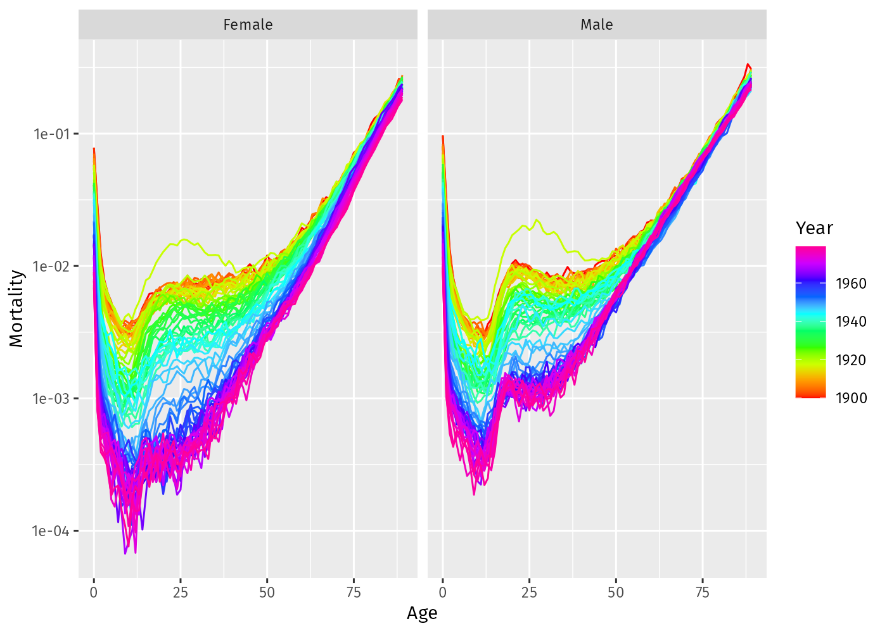
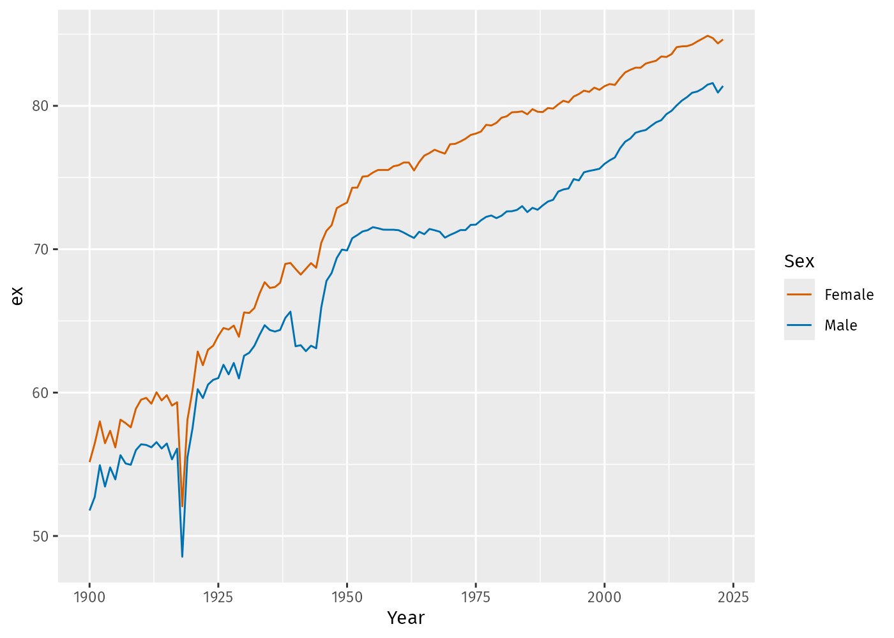
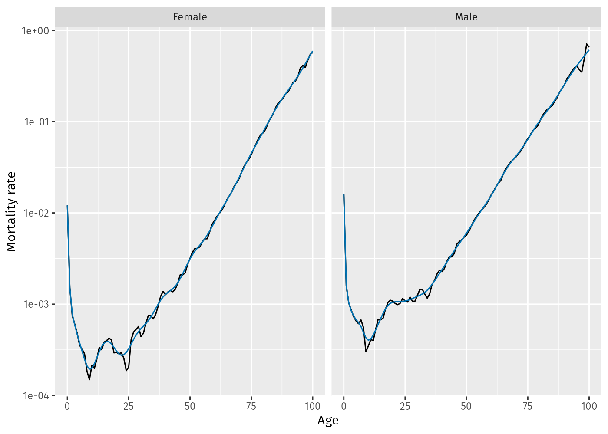
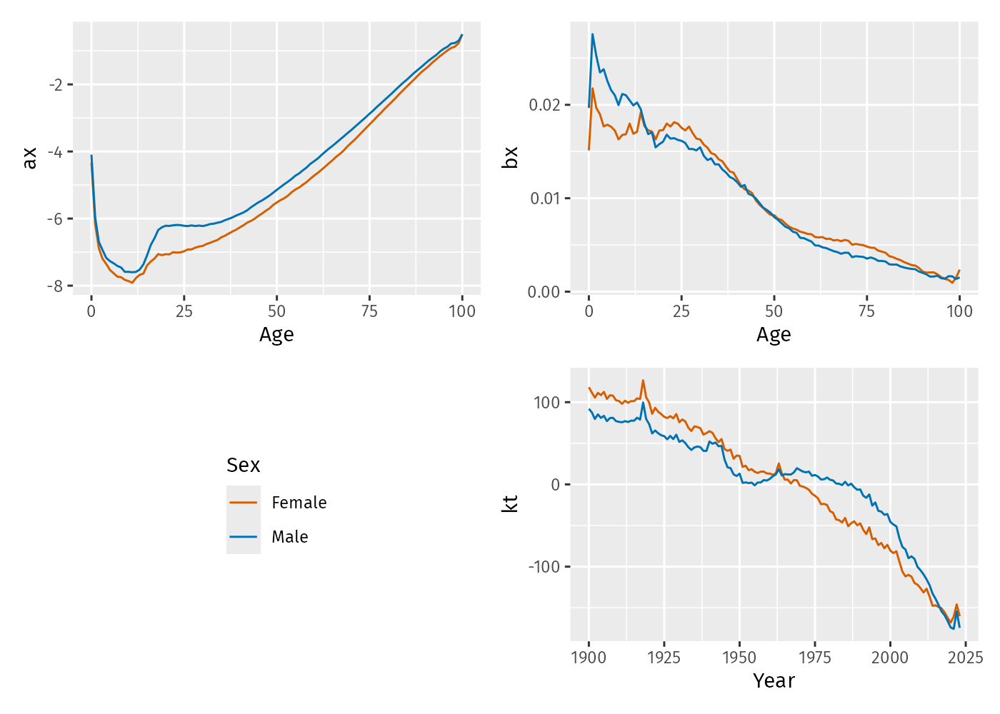

# vital 

The goal of vital is to allow analysis of demographic data using tidy
tools.

## Installation

You can install the **stable** version from
[CRAN](https://cran.r-project.org/package=vital):

``` r

pak::pak("vital")
```

You can install the **development** version from
[GitHub](https://github.com/robjhyndman/vital):

``` r

pak::pak("robjhyndman/vital")
```

## Examples

First load the necessary packages.

``` r

library(vital)
library(tsibble)
library(dplyr)
library(ggplot2)
```

### vital objects

The basic data object is a `vital`, which is time-indexed tibble that
contains vital statistics such as births, deaths, population counts, and
mortality and fertility rates.

Here is an example of a `vital` object containing mortality data for
Norway, with the upper ages collapsed into a final age group of 100+.

``` r

norway_mortality <- norway_mortality |>
  collapse_ages(max_age = 100)
norway_mortality
#> # A vital: 37,572 x 7 [1Y]
#> # Key:     Age x Sex [101 x 3]
#>     Year   Age OpenInterval Sex    Population Deaths Mortality
#>    <int> <int> <lgl>        <chr>       <dbl>  <dbl>     <dbl>
#>  1  1900     0 FALSE        Female      30070 2376.    0.0778
#>  2  1900     1 FALSE        Female      28960  842     0.0290
#>  3  1900     2 FALSE        Female      28043  348     0.0123
#>  4  1900     3 FALSE        Female      27019  216.    0.00786
#>  5  1900     4 FALSE        Female      26854  168.    0.00624
#>  6  1900     5 FALSE        Female      25569  140.    0.00538
#>  7  1900     6 FALSE        Female      25534  108.    0.00422
#>  8  1900     7 FALSE        Female      24314   93.5   0.00376
#>  9  1900     8 FALSE        Female      24979   93.5   0.00380
#> 10  1900     9 FALSE        Female      24428   90     0.00365
#> # ℹ 37,562 more rows
```

We can use functions to see which variables are index, key or vital:

``` r

index_var(norway_mortality)
#> [1] "Year"
key_vars(norway_mortality)
#> [1] "Age" "Sex"
vital_vars(norway_mortality)
#>          age          sex       deaths   population
#>        "Age"        "Sex"     "Deaths" "Population"
```

### Plots

``` r

norway_mortality |>
  filter(Sex != "Total", Year < 1980, Age < 90) |>
  autoplot(Mortality) + scale_y_log10()
```



### Life tables and life expectancy

``` r

# Life table for Norwegian males in 2000
norway_mortality |>
  filter(Sex == "Male", Year == 2000) |>
  life_table()
#> # A vital: 101 x 13 [?]
#> # Key:     Age x Sex [101 x 1]
#>     Year   Age Sex         mx        qx    lx        dx    Lx    Tx    ex    rx    nx     ax
#>    <int> <int> <chr>    <dbl>     <dbl> <dbl>     <dbl> <dbl> <dbl> <dbl> <dbl> <dbl>  <dbl>
#>  1  2000     0 Male  0.00426  0.00424   1     0.00424   0.996  76.0  76.0 0.996     1 0.0564
#>  2  2000     1 Male  0.000593 0.000593  0.996 0.000590  0.995  75.0  75.3 0.999     1 0.5
#>  3  2000     2 Male  0.000229 0.000229  0.995 0.000228  0.995  74.0  74.3 1.000     1 0.5
#>  4  2000     3 Male  0.000157 0.000157  0.995 0.000156  0.995  73.0  73.3 1.000     1 0.5
#>  5  2000     4 Male  0.000221 0.000221  0.995 0.000220  0.995  72.0  72.3 1.000     1 0.5
#>  6  2000     5 Male  0.000189 0.000189  0.995 0.000188  0.994  71.0  71.4 1.000     1 0.5
#>  7  2000     6 Male  0.000128 0.000128  0.994 0.000127  0.994  70.0  70.4 1.000     1 0.5
#>  8  2000     7 Male  0.000127 0.000127  0.994 0.000126  0.994  69.0  69.4 1.000     1 0.5
#>  9  2000     8 Male  0.000094 0.0000940 0.994 0.0000934 0.994  68.0  68.4 1.000     1 0.5
#> 10  2000     9 Male  0.000217 0.000217  0.994 0.000216  0.994  67.0  67.4 1.000     1 0.5
#> # ℹ 91 more rows
```

``` r

# Life expectancy
norway_mortality |>
  filter(Sex != "Total") |>
  life_expectancy() |>
  ggplot(aes(x = Year, y = ex, color = Sex)) +
  geom_line()
```



### Smoothing

Several smoothing functions are provided:
[`smooth_spline()`](https://pkg.robjhyndman.com/vital/reference/smooth_vital.md),
[`smooth_mortality()`](https://pkg.robjhyndman.com/vital/reference/smooth_vital.md),
[`smooth_fertility()`](https://pkg.robjhyndman.com/vital/reference/smooth_vital.md),
and
[`smooth_loess()`](https://pkg.robjhyndman.com/vital/reference/smooth_vital.md),
each smoothing across the age variable for each year. The
[`smooth_mortality_law()`](https://pkg.robjhyndman.com/vital/reference/smooth_mortality_law.md)
function fits a parametric mortality law instead.

``` r

# Smoothed data
norway_mortality |>
  filter(Sex != "Total", Year == 1967) |>
  smooth_mortality(Mortality) |>
  autoplot(Mortality) +
  geom_line(aes(y = .smooth), col = "#0072B2") +
  ylab("Mortality rate") +
  scale_y_log10()
```



### Mortality models

Several mortality models are available including variations on
Lee-Carter models (Lee & Carter, JASA, 1992), functional data models
(Hyndman & Ullah, CSDA, 2007), generalized age-period-cohort models from
the StMoMo package
([`LC2()`](https://pkg.robjhyndman.com/vital/reference/GAPC.md),
[`CBD()`](https://pkg.robjhyndman.com/vital/reference/GAPC.md),
[`APC()`](https://pkg.robjhyndman.com/vital/reference/GAPC.md),
[`RH()`](https://pkg.robjhyndman.com/vital/reference/GAPC.md),
[`M7()`](https://pkg.robjhyndman.com/vital/reference/GAPC.md),
[`PLAT()`](https://pkg.robjhyndman.com/vital/reference/GAPC.md) and
[`GAPC()`](https://pkg.robjhyndman.com/vital/reference/GAPC.md)), and
the benchmark models
[`FMEAN()`](https://pkg.robjhyndman.com/vital/reference/FMEAN.md) and
[`FNAIVE()`](https://pkg.robjhyndman.com/vital/reference/FNAIVE.md).

``` r

fit <- norway_mortality |>
  filter(Sex != "Total") |>
  model(
    lee_carter = LC(log(Mortality)),
    fdm = FDM(log(Mortality))
  )
fit
#> # A mable: 2 x 3
#> # Key:     Sex [2]
#>   Sex    lee_carter     fdm
#>   <chr>     <model> <model>
#> 1 Female       <LC>   <FDM>
#> 2 Male         <LC>   <FDM>
```

Models are fitted for all combinations of key variables excluding age.

``` r

fit |>
  select(lee_carter) |>
  filter(Sex == "Female") |>
  report()
#> Series: Mortality
#> Model: LC
#> Transformation: log(Mortality)
#>
#> Options:
#>   Adjust method: dt
#>   Jump choice: fit
#>
#> Age functions
#> # A tibble: 101 × 3
#>     Age    ax     bx
#>   <int> <dbl>  <dbl>
#> 1     0 -4.33 0.0151
#> 2     1 -6.16 0.0218
#> 3     2 -6.88 0.0197
#> 4     3 -7.20 0.0190
#> 5     4 -7.35 0.0177
#> # ℹ 96 more rows
#>
#> Time coefficients
#> # A tsibble: 124 x 2 [1Y]
#>    Year    kt
#>   <int> <dbl>
#> 1  1900  118.
#> 2  1901  112.
#> 3  1902  105.
#> 4  1903  111.
#> 5  1904  109.
#> # ℹ 119 more rows
#>
#> Time series model: RW w/ drift
#>
#> Variance explained: 92.39%
```

``` r

fit |>
  select(lee_carter) |>
  autoplot()
```



``` r

fit |>
  select(lee_carter) |>
  age_components()
#> # A tibble: 202 × 4
#>    Sex      Age    ax     bx
#>    <chr>  <int> <dbl>  <dbl>
#>  1 Female     0 -4.33 0.0151
#>  2 Female     1 -6.16 0.0218
#>  3 Female     2 -6.88 0.0197
#>  4 Female     3 -7.20 0.0190
#>  5 Female     4 -7.35 0.0177
#>  6 Female     5 -7.53 0.0179
#>  7 Female     6 -7.63 0.0177
#>  8 Female     7 -7.73 0.0173
#>  9 Female     8 -7.75 0.0163
#> 10 Female     9 -7.83 0.0168
#> # ℹ 192 more rows
fit |>
  select(lee_carter) |>
  time_components()
#> # A tsibble: 248 x 3 [1Y]
#> # Key:       Sex [2]
#>    Sex     Year    kt
#>    <chr>  <int> <dbl>
#>  1 Female  1900  118.
#>  2 Female  1901  112.
#>  3 Female  1902  105.
#>  4 Female  1903  111.
#>  5 Female  1904  109.
#>  6 Female  1905  113.
#>  7 Female  1906  104.
#>  8 Female  1907  108.
#>  9 Female  1908  108.
#> 10 Female  1909  102.
#> # ℹ 238 more rows
```

``` r

fit |> forecast(h = 20)
#> # A vital fable: 8,080 x 6 [1Y]
#> # Key:           Age x (Sex, .model) [101 x 4]
#>    Sex    .model      Year   Age          Mortality    .mean
#>    <chr>  <chr>      <int> <int>             <dist>    <dbl>
#>  1 Female lee_carter  2024     0 t(N(-6.8, 0.0087)) 0.00113
#>  2 Female lee_carter  2025     0  t(N(-6.8, 0.017)) 0.00110
#>  3 Female lee_carter  2026     0  t(N(-6.9, 0.026)) 0.00106
#>  4 Female lee_carter  2027     0  t(N(-6.9, 0.035)) 0.00103
#>  5 Female lee_carter  2028     0  t(N(-6.9, 0.045)) 0.00100
#>  6 Female lee_carter  2029     0    t(N(-7, 0.054)) 0.000973
#>  7 Female lee_carter  2030     0    t(N(-7, 0.064)) 0.000944
#>  8 Female lee_carter  2031     0    t(N(-7, 0.073)) 0.000917
#>  9 Female lee_carter  2032     0  t(N(-7.1, 0.083)) 0.000890
#> 10 Female lee_carter  2033     0  t(N(-7.1, 0.093)) 0.000864
#> # ℹ 8,070 more rows
```

The forecasts are returned as a distribution column (here transformed
normal because of the log transformation used in the model). The `.mean`
column gives the point forecasts equal to the mean of the distribution
column.
