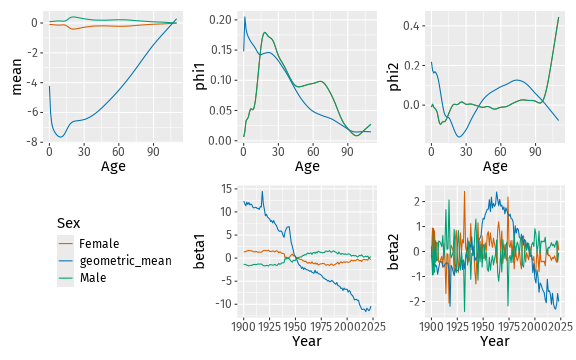
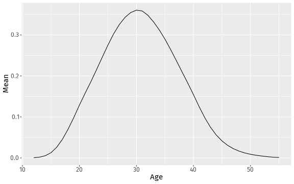
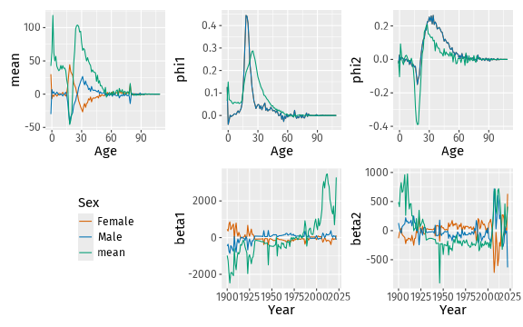
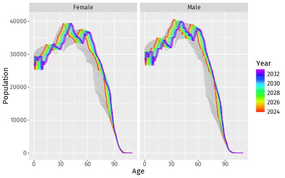
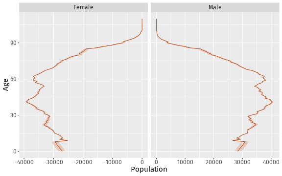

``` r
library(vital)
library(fable)
library(dplyr)
library(ggplot2)
set.seed(2025)
```

The vital package can be used for stochastic population forecasting with coherent components. This is based on the papers by @HB08 and @hby. Following @HB08, we use the following demographic growth-balance equations:
$$
P_t(x) = P_{t-1}(x) + B_t(x) - D_t(x) + G_t(x)
$$
where

* $P_t(x)$ is the population at time $t$ and age $x$,
* $B_t(x)$ is the number of births at time $t$ and age $x$,
* $D_t(x)$ is the number of deaths at time $t$ and age $x$, and
* $G_t(x)$ is the number of net migrants at time $t$ and age $x$.

There are slightly different equations for handling the upper age group, and for baby migrants. See @HB08 for details.

To simulate future births, deaths and net migrants, we develop three functional data models for fertility, mortality and migration. The models for mortality and migration use coherent components, so that the rates for males and females do not diverge over time.

The following example uses Norwegian data up to 2022, and produces simulated populations for the ten future years. Different models are used for each component to demonstrate the flexibility of the package, but other models can be used as well.

## Mortality model

We use a coherent functional data model [@hby] for the log mortality rates. To ensure coherence, we compute the geometric mean of the sex-specific mortality rates and the corresponding ratios, using the `make_pr()` function. The data are smoothed first, and 6 components are used by default in each FDM, although only the first two are plotted here.


``` r
fit_mortality <- norway_mortality |>
  filter(Sex != "Total") |>
  smooth_mortality(Mortality) |>
  make_pr(.smooth) |>
  model(fdm = FDM(log(.smooth), coherent = TRUE))
autoplot(fit_mortality, 2)
```

<div class="figure">

<p class="caption">First two components of the functional data model for mortality rates.</p>
</div>

## Fertility model

For fertility, we use a functional mean model with a square root transformation, applied to the last 13 years of data. The plotted model shows the fitted values on the square root scale.


``` r
fit_fertility <- norway_fertility |>
  filter(Year > 2010) |>
  smooth_fertility(Fertility) |>
  model(fmean = FMEAN(sqrt(.smooth)))
autoplot(fit_fertility)
```

<div class="figure">

<p class="caption">Fitted values of the functional mean model for fertility rates.</p>
</div>

## Net migration model

For net migration, we use a coherent functional data model. Because net migration values can be positive or negative, we can't take products and ratios. Instead, we need to compute the means and corresponding differences using the `mean_sd()` function.


``` r
netmig <- net_migration(
  norway_mortality |> filter(Sex != "Total"),
  norway_births
) |>
  make_sd(NetMigration)
fit_migration <- netmig |>
  model(fdm = FDM(NetMigration, coherent = TRUE))
autoplot(fit_migration)
```

<div class="figure">

<p class="caption">First two components of the functional data model for net migration.</p>
</div>

## Population simulation

The `generate_population()` function takes a starting population, and the three component models, and simulates future age-sex-specific population values. Here we produce ten replicates of the future population.


``` r
pop <- norway_mortality |>
  filter(Sex != "Total", Year == max(Year))
future <- generate_population(
  starting_population = pop,
  mortality_model = fit_mortality,
  fertility_model = fit_fertility,
  migration_model = fit_migration,
  h = 10,
  n_reps = 500
)
```

The first replicate is plotted below, along with the last few years of historical data.


``` r
future |>
  filter(.rep == "100") |>
  ggplot(aes(x = Age, y = Population, group = Year, color = Year)) +
  geom_line(
    data = norway_mortality |> filter(Year > 2010, Sex != "Total"),
    color = "grey",
    mapping = aes(group = Year)
  )  +
  geom_line() +
  scale_color_gradientn(colours = rainbow(10)[1:9]) +
  facet_grid(. ~ Sex)
```

<div class="figure">

<p class="caption">Simulated population for the first replicate.</p>
</div>

The simulated populations can be used to compute any quantities that can be derived from populations numbers by sex and age. For example, the mean age of the population for the next 10 years


``` r
future |>
  group_by(Sex, .rep) |>
  summarise(mean_age = sum(Population * (Age + 0.5)) / sum(Population)) |>
  group_by(Sex) |>
  summarise(mean_age = mean(mean_age))
#> # A vital: 20 x 3 [1Y]
#> # Key:     Sex [2]
#>    Sex     Year mean_age
#>    <chr>  <dbl>    <dbl>
#>  1 Female  2024     42.0
#>  2 Female  2025     42.3
#>  3 Female  2026     42.5
#>  4 Female  2027     42.7
#>  5 Female  2028     42.9
#>  6 Female  2029     43.1
#>  7 Female  2030     43.4
#>  8 Female  2031     43.6
#>  9 Female  2032     43.8
#> 10 Female  2033     44.0
#> 11 Male    2024     40.7
#> 12 Male    2025     40.9
#> 13 Male    2026     41.2
#> 14 Male    2027     41.4
#> 15 Male    2028     41.6
#> 16 Male    2029     41.9
#> 17 Male    2030     42.1
#> 18 Male    2031     42.3
#> 19 Male    2032     42.5
#> 20 Male    2033     42.7
```

We can also plot population pyramids with prediction intervals. For example, here is the population pyramid for 2032 with a 95% prediction interval.


``` r
pyramid_2032 <- future |>
  filter(Year == 2032) |>
  mutate(Population = if_else(Sex == "Female", -Population, Population)) |>
  group_by(Age, Sex) |>
  summarise(
    lo = quantile(Population, 0.025),
    med = quantile(Population, 0.5),
    hi = quantile(Population, 0.975)
  )
pyramid_2032 |>
  ggplot(aes(x = Age)) +
  geom_ribbon(aes(ymin = lo, ymax = hi, colour = NULL),
    fill = "#c14b14", alpha = 0.2
  ) +
  geom_line(aes(y = med), color = "#c14b14") +
  facet_grid(. ~ Sex, scales = "free_x") +
  labs(y = "Population") +
  coord_flip() +
  guides(fill = "none", alpha = "none")
```

<div class="figure">

<p class="caption">Population pyramid for 2032 with 95% prediction intervals.</p>
</div>

## References
